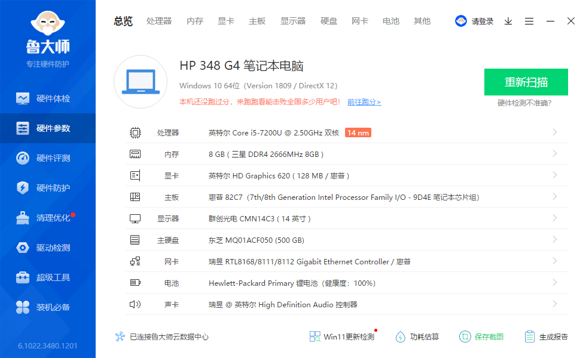

# hp_348_g4_hackintosh

| | |
|--|--|
|　cpu          | 英特尔 Core i5-7200U @ 2.50GHz 双核 |
|　motherboard  | 惠普 82C7（7th/8th Generation Intel Processor Family I/O - 9D4E 笔记本芯片组）|
|  显卡         |          英特尔 HD Graphics 620 ( 128 MB / 惠普 ) |
|  内存         |          8 GB ( 三星 DDR4 2666MHz 8GB ) |
|  主硬盘       |          东芝 MQ01ACF050 (500 GB) |
|  显示器       |          群创光电 CMN14C3 ( 14 英寸  ) |
|  声卡         |          瑞昱  @ 英特尔 High Definition Audio 控制器 |
|  网卡         |          瑞昱 RTL8168/8111/8112 Gigabit Ethernet Controller / 惠普 |
|  wifi         |          Intel(R) Dual Band Wireless-AC 3168